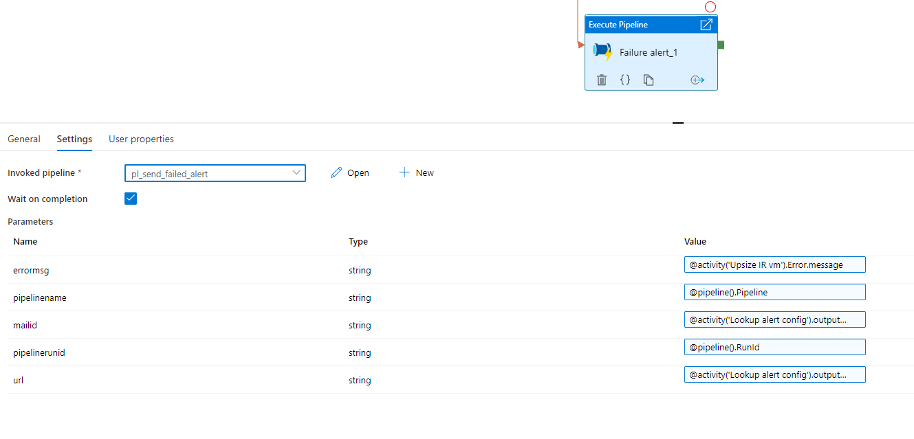

# Parametes accepted by pipeline 
    errormsg            : failure error message of calling pipeline/avtivity in adf. Example value @activity('Execute delta data copy and persist').Error.message
    pipelinename        : pipeline name of calling pipeline/activity in adf. 
    pipelinerunid       : pipeline run of calling pipeline in adf. 
    mailid              : mail id to which alert is sent to. Should be passed by a config file. 
    url                 : web url for logic app. Should be passed by a config file.

#Instructions

-   Use lookup in pipeline to get alet config located in all environments at <datalake-container/config/alert/alert.json>
-   In you want to test the alerting only to your mail, change the parameter mailid to your email id in calling execute pipeline activity

    

# Implementing alerting tips
-   Try to implement alerting at all activity levels.
-   If activites are wrapped up in a pipeline, implement alerting at excute pipeline activity.
-   Dont overdo it. 

